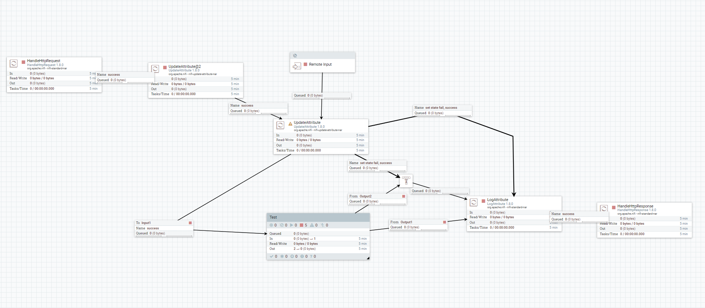
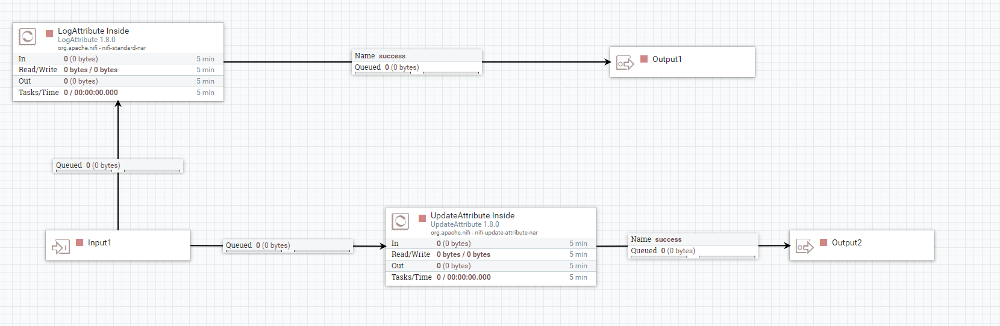

# NifiTemplatizer
The purpose of this project is to create exports of NiFi workspaces that are easier for developers to read and modify. With that purpose in mind, a simplified YAML format was generated to concisely express the content in the NiFi workspace. As an added bonus, the simplified YAML format also makes it easier to perform standard actions (diffs/merges/etc) in version control systems to track changes over time to the NiFi workspace.

# Commands:
Feature compliance is being validated against NiFi 1.8.0 API DAOs: [Link](https://github.com/apache/nifi/tree/rel/nifi-1.8.0/nifi-nar-bundles/nifi-framework-bundle/nifi-framework/nifi-web/nifi-web-api/src/main/java/org/apache/nifi/web/dao/impl)
  
  
* Import (60% complete)
  - [x] Generic
    - [x] Position
  - [x] Controllers
    - [x] Name
    - [x] ~~Annotation Data (Field exists, but not sure what its for?)~~
    - [x] Comments
    - [x] Properties
  - [x] Processors
    - [x] Name
    - [x] Styles (Colors/Fonts)
    - [x] Properties
    - [x] Annotation Data (advanced rules)
    - [x] Scheduling 
      - (schedulingStrategy, schedulingPeriod, maxTasks, penaltyDuration, yieldDuration, runDuration, executionNode)
    - [x] Bulletin Level
    - [x] Terminated relationships (auto terminating based on unused state)
    - [x] Comments
  - [x] Ports (Input/Output)
    - [x] Name
    - [x] Comments
  - [x] Funnels
  - [x] Process Groups
    - [x] Name
    - [x] Comments (works on update call only)
  - [ ] Remote Process Groups
    - [x] TargetUris
    - [x] Name
    - [ ] Comments
    - [ ] Yield Duration
    - [ ] Connection Properties:
      - Proxy Host, Proxy Port, Proxy User, Proxy Password
      - Communications timeout, Transport Protocol, Local Network Interface, yieldDuration
    - [ ] Remote Port Settings:
      - maxConcurrentTasks, useCompression
      - batchCount, batchSize, batchDuration
  - [x] Labels
    - [x] Comment
    - [x] Styles (Colors/Fonts)
    - [x] Width/Height
  - [ ] Connectivity (Inputs/Outputs/Relationships) (90%)
    - [x] Name
    - [ ] Queueing properties
      - flowFileExpiration, backPressureObjectThreshold, backPressureDataSizeThreshold, prioritizers
      - loadBalanceStrategy, loadBalancePartition, loadBalanceCompression
    - [ ] Link bends (aesthetic)
    - [ ] Label Index (which bend the label goes on)
    - [ ] Z index
    - [ ] Links to/from RemoteProcessGroups
* Export (100% functionally complete, stretch goals remaining)
  - [x] Generic
    - [x] Position
  - [x] Dependency Tree
    - [x] Extract all dependencies of workspace
    - [x] Canonical name generation for dependencies
  - [x] Controllers
    - [x] Name
    - [x] ~~Annotation Data  (Field exists, but not sure what its for?)~~
    - [x] Comments
    - [x] Properties
  - [x] Processors
    - [x] Name
    - [x] Styles (Colors/Fonts)
    - [x] Properties
    - [x] Annotation Data (advanced rules)
    - [x] Scheduling 
      - (schedulingStrategy, schedulingPeriod, maxTasks, penaltyDuration, yieldDuration, runDuration, executionNode)
    - [x] Bulletin Level
    - [x] ~~Terminated relationships (implied atm)~~
    - [x] Comments
  - [x] Ports (Input/Output)
    - [x] Name
    - [x] Comments
  - [x] Funnels
  - [x] Process Groups
    - [x] Name
    - [x] Comments
    - [ ] STRETCH: De-duplicate structurally similar templates (extract variables for varying properties)
  - [x] Remote Process Groups
    - [x] TargetUris
    - [x] Name
    - [x] Comments
    - [x] Connection Properties:
      - Proxy Host, Proxy Port, Proxy User, Proxy Password
      - Communications timeout, Transport Protocol, Local Network Interface, yieldDuration
    - [x] Remote Port Settings:
      - maxConcurrentTasks, useCompression
      - batchCount, batchSize, batchDuration
  - [x] Labels
    - [x] Comment
    - [x] Styles (Colors/Fonts)
    - [x] Width/Height
  - [x] Connectivity (Inputs/Outputs/Relationships) (90%)
    - [x] Name
    - [x] Queueing properties
      - flowFileExpiration, backPressureObjectThreshold, backPressureDataSizeThreshold, prioritizers
      - loadBalanceStrategy, loadBalancePartition, loadBalanceCompression
    - [x] Link bends (aesthetic)
    - [x] Label Index (which bend the label goes on)
    - [x] Z index
* Clean (100% complete)
  - Remove all content from workspace (clean slate)
* Set State (100% complete)
  - Enable or disable all processors in a workspace
* Permissions (0% complete)
  - [ ] Give all permissions to specified user

# Example
Test workspace to cover lots of commonly used features in NiFi. The exported YAML is roughly 1/10th the size of the XML template export.

Total Size: 
- YAML Export = 5571 bytes (8% size of XML)
- XML  Export = 66842 bytes

[Export of the NiFi template XML](https://github.com/profour/NifiTemplatizer/blob/master/examples/simple/Simple_Example.xml)

[Export of the Root workspace](https://github.com/profour/NifiTemplatizer/blob/master/examples/simple/root.yaml)

[Export of the Test Subgroup](https://github.com/profour/NifiTemplatizer/blob/master/examples/simple/bbfb5e15-016c-1000-24e9-c7827e34b838.yaml)

Input Root workspace:

Test Process Group workspace:

